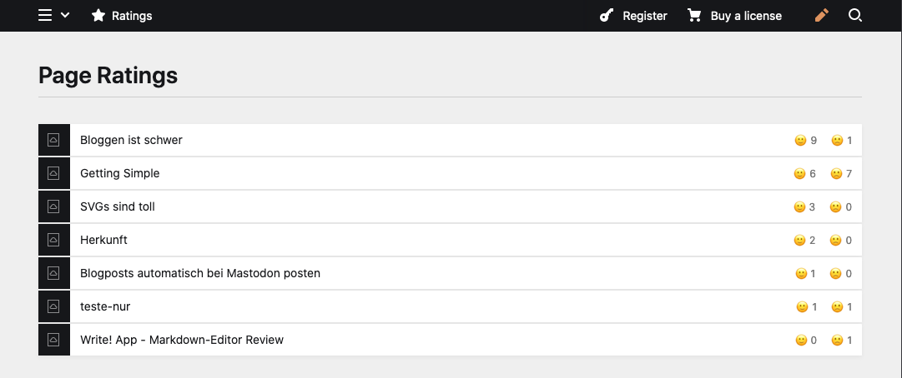

# Rate Page

## A Kirby rating plugin with webmention support

  

A Page Rating Plugin. Working without page reload and can also receive webmentions. Comes with a nice panel overview of all the ratings.



If you like something without javascript and webmentions, please do have a look at https://getkirby.com/plugins/medienbaecker/likes

## Installation

- `composer require mauricerenck/ratepage`
- unzip [master.zip](https://github.com/mauricerenck/rate-page/releases/latest) to `site/plugins/rate-page`
- `git submodule add https://github.com/mauricerenck/rate-page.git site/plugins/rate-page`

## Config

Add your own emoji oder html code in the config.php

```
[
    'thumb-up-symbol' => '👍',
    'thumb-down-symbol' => '👎'
    'enable-webmention-support' => false
]
```

You can enable webmention support in the config. When doing so, you also have to install my webmention plugin (https://github.com/mauricerenck/tratschtante). You can then use a service like brid.gy/ to connect your twitter or mastodon account to webmentions.io. When someone likes you related tweed the like will be also added as a positive page rating.

## Usage

In your template, just load the snippet:

`<?php snippet('thumb-rating'); ?>`

## Future Plans

- json-ld output
- fivestar ratings
